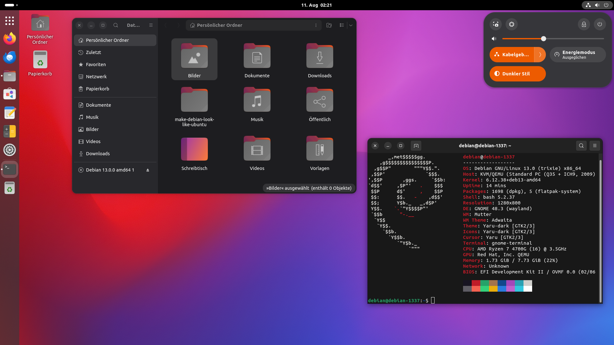

# make-cachyos-kde-look-like-unity

**KDE Branch - Unity-style Layout for CachyOS KDE Plasma**  
**Original Author:** DeltaLima  
**Adapted for KDE by:** Anonymo

This script performs all necessary steps to make a CachyOS KDE Plasma desktop look and feel like Ubuntu Unity with native KDE features.

## Why KDE is Better for Unity-style Layout

KDE Plasma provides superior Unity emulation compared to GNOME because:

- ✅ **Native Global Menu Support** - Built-in, no extensions required
- ✅ **Better Panel Customization** - Pixel-perfect sizing (24px top, 48px dock)
- ✅ **Stable Configuration** - Settings persist through updates
- ✅ **Window Button Integration** - Native support for left-side buttons
- ✅ **Better Performance** - More efficient than GNOME with extensions
- ✅ **HUD via KRunner** - Native Alt+Space search functionality

## Prerequisites

- CachyOS with KDE Plasma desktop environment
- User must be in the `wheel` group (for sudo access)
- An AUR helper installed (`yay` or `paru`)

## Installation

### Step 1: Install prerequisites (if needed)
```bash
# Install git (if not already installed)
sudo pacman -S git

# Install an AUR helper (if you don't have yay or paru)
sudo pacman -S --needed base-devel
git clone https://aur.archlinux.org/yay.git
cd yay
makepkg -si
cd ..
```

### Step 2: Clone and run
```bash
# Clone the KDE branch
git clone -b KDE https://github.com/Anonymo/make-cachyOS-look-like-ubuntu.git
cd make-cachyOS-look-like-ubuntu

# Run the transformation script
bash make-cachyos-kde-look-like-unity.sh
```

**Important!** After the first run, you have to **reboot and re-run** the script. 
When the script runs the first time, it is normal that the terminal font looks different after it. This normalizes after a reboot.

## What it installs

### Official Repository Packages
- Ubuntu fonts, Liberation fonts, Noto fonts
- Plymouth for boot splash
- KDE Plasma desktop and applications
- NetworkManager OpenVPN support
- Thunderbird email client
- Konsole terminal emulator
- rofi-wayland (alternative launcher)

### AUR Packages
- `ttf-ms-fonts` - Microsoft core fonts
- `yaru-gtk-theme` - Ubuntu's Yaru GTK theme
- `yaru-icon-theme` - Ubuntu's Yaru icon theme  
- `yaru-sound-theme` - Ubuntu's Yaru sound theme
- `latte-dock` - Unity-style dock with 48px icons
- `appmenu-gtk-module-git` - Global menu support for GTK applications
- `libdbusmenu-glib` - DBus menu library for global menu
- `libdbusmenu-gtk3` - GTK3 global menu support
- `libdbusmenu-gtk2` - GTK2 global menu support

### KDE Configuration

The script automatically configures:

#### Panel Layout
- **Top Panel (24px height)**
  - Application menu widget
  - Global menu bar (native KDE)
  - System tray
  - Clock
  
- **Left Dock (Latte Dock)**
  - 48px icon size (Unity-style)
  - Unity-style indicators
  - Applications launcher at top
  - Intelligent auto-hide

#### Window Management
- Window buttons on left: Close, Minimize, Maximize
- Borderless maximized windows
- Global menu integration (native)

#### Keyboard Shortcuts
- **Super key**: Application dashboard
- **Alt+Space**: KRunner (HUD-like search)
- **Ctrl+Alt+T**: Terminal
- All Unity-style shortcuts configured

## Troubleshooting

### Global Menu Not Working
- **Issue:** GTK apps don't show global menu
- **Solution:** Ensure environment variables are set:
```bash
export GTK_MODULES=appmenu-gtk-module
export UBUNTU_MENUPROXY=1
```

### Bootloader Support
- **GRUB:** Automatically configured for quiet splash
- **systemd-boot:** Manual configuration needed (instructions provided)
- **rEFInd/Limine:** Manual configuration needed (instructions provided)

### Group Membership
- **Issue:** "not in sudo group" error
- **Solution:** Add user to wheel group: `su -c "usermod -aG wheel $USER"`

### Latte Dock Not Starting
- **Issue:** Dock doesn't appear after installation
- **Solutions:**
  1. Start manually: `latte-dock --layout Unity &`
  2. Check for errors: `latte-dock --debug`
  3. Ensure autostart is enabled
  4. Check if Unity layout exists in ~/.config/latte/

### Plasma Needs Restart
- **Issue:** Changes don't appear immediately
- **Solution:** Restart Plasma:
```bash
kquitapp5 plasmashell && kstart5 plasmashell
```
Or logout and login again.

## Undoing the Transformation

If you want to revert back to the original CachyOS KDE appearance:

```bash
# From the repository directory
bash undo-unity-kde-transformation.sh
```

The undo script will:
- ✅ Reset KDE Plasma settings to CachyOS defaults
- ✅ Remove Unity-style layout and Latte Dock
- ✅ Restore window buttons to right side
- ✅ Disable global menu
- ✅ Reset keyboard shortcuts
- ✅ Create a backup before making changes
- ⚠️ Optionally remove Ubuntu packages

**Note:** Some panel configurations may require manual adjustment.

## Unity-like Features

The KDE version provides a complete Unity-like experience with:

### Native Global Menu
- **Built-in KDE Feature**: No extensions needed
- **Full Application Support**: Works with Qt and GTK apps
- **Panel Integration**: Menus appear in top panel (24px height)
- **Window Title**: Shows in panel for maximized windows

### HUD Functionality via KRunner
- **Alt+Space**: Opens KRunner for HUD-like search
- **Application Search**: Find apps, files, and settings
- **Command Execution**: Run commands directly
- **Native KDE Feature**: Stable and integrated

### Unity-style Dock (Latte)
- **48px Icons**: Unity-standard icon size
- **Left Positioning**: Classic Unity dock placement  
- **Intelligent Hide**: Auto-hides when windows overlap
- **Unity Indicators**: Running app indicators

## Comparison: KDE vs GNOME for Unity

| Feature | KDE | GNOME |
|---------|-----|-------|
| Global Menu | Native ✅ | Extension (unstable) ⚠️ |
| Panel Customization | Native ✅ | Limited ⚠️ |
| Dock | Latte Dock ✅ | Dash-to-Dock extension ⚠️ |
| HUD | KRunner (native) ✅ | gnome-hud (3rd party) ⚠️ |
| Stability | High ✅ | Medium with extensions ⚠️ |
| Performance | Better ✅ | Slower with extensions ⚠️ |

KDE Plasma makes a better Unity clone than GNOME because global menus and panel customization are native features!


