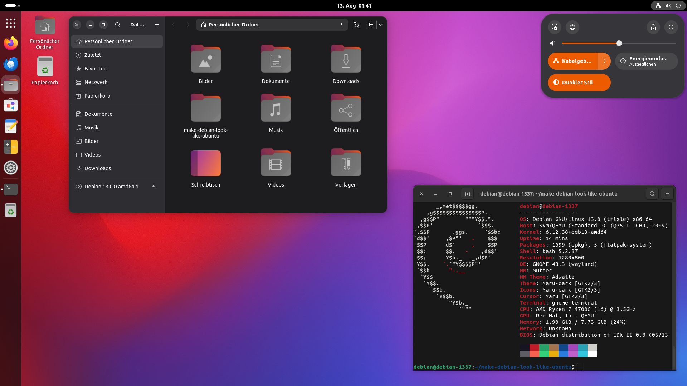

# make-cachyos-look-like-ubuntu

**Adapted for CachyOS from:** https://git.la10cy.net/DeltaLima/make-debian-look-like-ubuntu  
**Original Author:** DeltaLima  
**Adapted by:** raul

This script performs all necessary steps to make a CachyOS GNOME desktop look like an Ubuntu desktop.

## Key Changes for CachyOS

- ✅ **Package Manager**: Replaced `apt` with `pacman` 
- ✅ **AUR Support**: Added support for both `yay` and `paru` AUR helpers
- ✅ **Package Names**: Updated to CachyOS/Arch Linux equivalents
- ✅ **Yaru Theme**: Installs Ubuntu's Yaru theme from AUR
- ✅ **No Firefox Flatpak**: Removed Firefox flatpak installation (uses system Firefox)
- ✅ **No Flatpak Dependencies**: Removed unnecessary flatpak/flathub setup
- ✅ **Repository Config**: Uses pacman.conf instead of sources.list

## Prerequisites

- CachyOS with GNOME desktop environment
- User must be in the `sudo` group
- An AUR helper installed (`yay` or `paru`)

## Installation

### Quick One-Command Installation (Recommended)

```bash
curl -fsSL https://raw.githubusercontent.com/Anonymo/make-cachyOS-look-like-ubuntu/main/install.sh | bash
```

### Manual Installation (Step-by-Step)

#### Step 1: Install required tools
```bash
# Install git if not already installed
sudo pacman -S git

# Install an AUR helper if you don't have one
sudo pacman -S --needed base-devel git
git clone https://aur.archlinux.org/yay.git
cd yay
makepkg -si
cd ..
```

#### Step 2: Clone this repository
```bash
git clone https://github.com/Anonymo/make-cachyOS-look-like-ubuntu.git
cd make-cachyOS-look-like-ubuntu
```

#### Step 3: Run the script
```bash
bash make-cachyos-look-like-ubuntu.sh
```

**Important!** After the first run, you have to **reboot and re-run** the script. 
When the script runs the first time, it is normal that the terminal font looks different after it. This normalizes after a reboot.

## What it installs

### Official Repository Packages
- Ubuntu fonts, Liberation fonts, Noto fonts
- Plymouth, GNOME extensions, GNOME tweaks
- GNOME Software (package manager GUI)
- NetworkManager OpenVPN support
- Thunderbird email client

### AUR Packages
- `ttf-ms-fonts` - Microsoft core fonts
- `yaru-gtk-theme` - Ubuntu's Yaru GTK theme
- `yaru-icon-theme` - Ubuntu's Yaru icon theme  
- `yaru-sound-theme` - Ubuntu's Yaru sound theme
- `yaru-gnome-shell-theme` - Ubuntu's Yaru GNOME Shell theme


